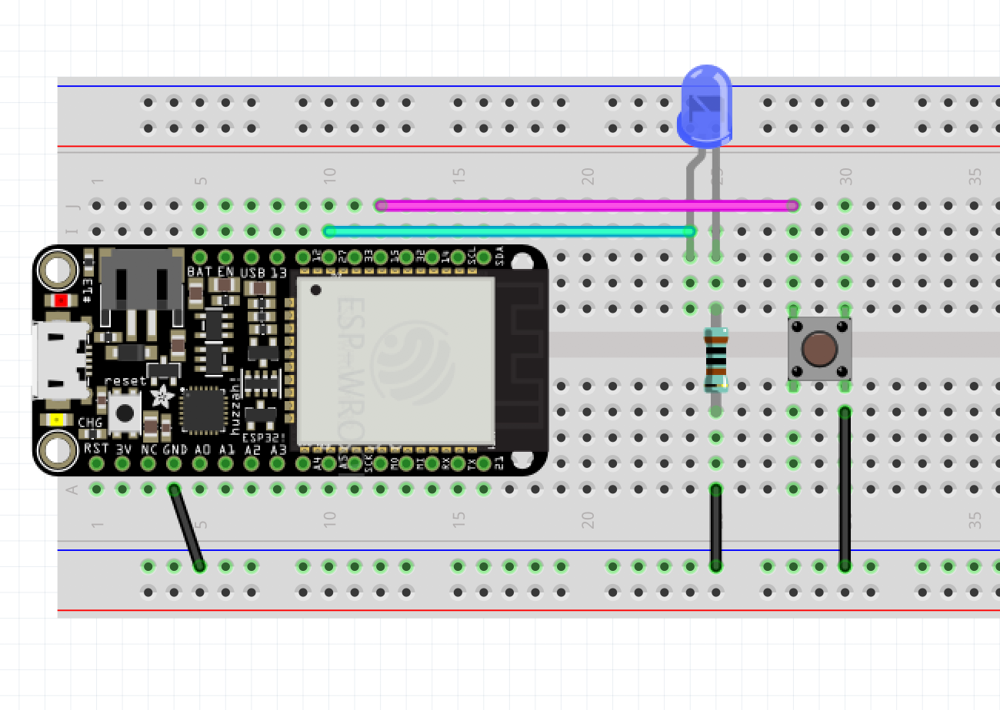
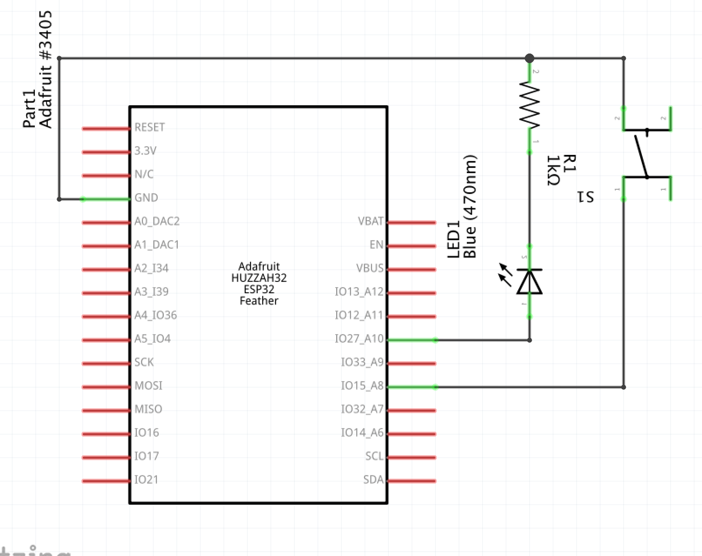

# Blink an LED





```cpp
/* Things to try:
 *
 * - use the internal PULLUP on the chip instead of a resistor on the board
 *
 */

const int LEDPIN = 27;
const int BUTTONPIN = 15;

void setup()
{
    pinMode(LEDPIN, OUTPUT);
    pinMode(BUTTONPIN, INPUT_PULLUP);

    // To use the commented line below, instead of the one above,
    // wire the input pin to power with a resistor.
    // You need to provide a default value for your button,
    // and using an on-board resistor is another way to do that.
    // pinMode(BUTTONPIN, INPUT);
}

void loop()
{
    if (digitalRead(BUTTONPIN) == LOW) {
        digitalWrite(LEDPIN, HIGH);
    } else {
        digitalWrite(LEDPIN, LOW);
    }
}
```
