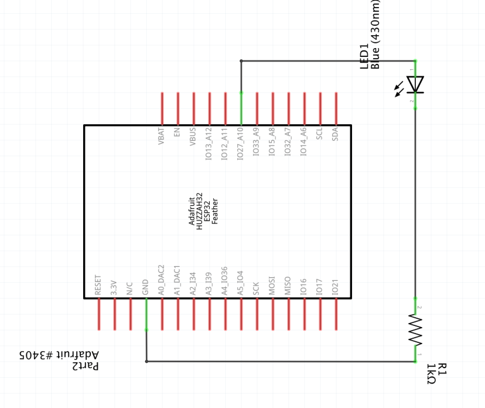

# Blink an LED




```cpp
const int LEDPIN = 27;

void setup()
{
    pinMode(LEDPIN, OUTPUT);
}

void loop()
{
    digitalWrite(LEDPIN, HIGH);
    delay(500);
    digitalWrite(LEDPIN, LOW);
    delay(500);
}
```
